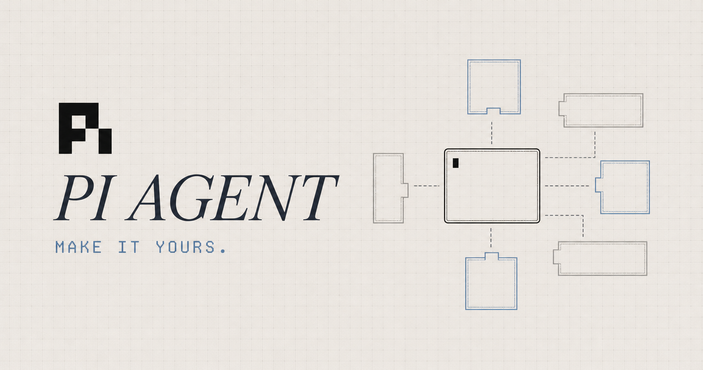

# pi-config



Personal configuration for [Pi](https://pi.dev/), a terminal coding agent. This repository is the contents of `~/.pi/agent`: TypeScript extensions that add tools, slash commands, and UI to the agent, plus skills and themes.

Pi loads everything here at startup from its own directory. There is no build step; Pi runs the TypeScript directly.

## What's included

15 extensions registering 16 model-facing tools and 12 slash commands, 2 skills, and 4 themes.

### Extensions

| Extension                | Tools                                                                                   | Commands             | What it does                                                                                                                                                                                                                                                                                                                                                                                                                      |
| ------------------------ | --------------------------------------------------------------------------------------- | -------------------- | --------------------------------------------------------------------------------------------------------------------------------------------------------------------------------------------------------------------------------------------------------------------------------------------------------------------------------------------------------------------------------------------------------------------------------- |
| `subagents`              | `subagent_spawn`, `subagent_wait`, `subagent_cancel`, `subagent_check`, `subagent_list` | `/subagents`, `/btw` | Spawns background subagents on three real backends (in-process Pi sessions, Claude Agent SDK, and `codex app-server` over JSON-RPC) behind one interface. Max 4 running. Unawaited results arrive as follow-up messages. Finished backend sessions close automatically; bounded terminal snapshots remain available for read-only review in `/subagents`. `/btw` asks a one-off side question while the main agent keeps working. |
| `workflows`              | `workflow`                                                                              | `/workflows`         | Model-authored multi-agent orchestration. The model writes a JavaScript script inline that runs ordered phases and fans work out to isolated subagents via `agent()` / `parallel()`. Runs blocking by default, or `background: true`. It saves artifacts under `~/.pi/agent/workflows/<runId>/`.                                                                                                                                  |
| `background-terminals`   | `bg_start`, `bg_status`, `bg_list`, `bg_kill`                                           | `/ps`                | Long-running shell processes the model can inspect and stop but never write to (stdin is ignored at the OS level). Max 8 concurrent; one exit notification per process. A widget above the editor shows the running count.                                                                                                                                                                                                        |
| `file-search`            | `fd`, `rg`                                                                              | —                    | First-class file-find and grep tools. Prefers a system-installed `fd`/`rg` (or `fdfind` on Debian/Ubuntu), then a binary already in `bin/`, and only downloads an official release into `bin/` when neither exists.                                                                                                                                                                                                               |
| `firecrawl-search`       | `search`, `scrape`, `crawl`                                                             | —                    | Web search, page scrape, and site crawl via [Firecrawl](https://firecrawl.dev). Requires an API key.                                                                                                                                                                                                                                                                                                                              |
| `ask-user`               | `ask_user`                                                                              | —                    | Lets the model ask a single multiple-choice question (2–5 options plus "Write my own answer") in a popup. Esc declines and tells the model so.                                                                                                                                                                                                                                                                                    |
| `add-dir`                | —                                                                                       | `/add-dir`           | Adds another working directory to the current session without changing its primary working directory. Validates and canonicalizes the path, completes directory names, and teaches the agent to use absolute paths there. The directory survives reloads and forks in the current process, but not new or resumed sessions.                                                                                                       |
| `multi-account`          | —                                                                                       | `/account`           | Registers named ZAI and OpenAI Codex accounts as independent provider IDs, such as `zai:personal` and `openai-codex:work`. Each provider ID has its own credential in Pi while reusing the built-in provider's models, authentication, and streaming behavior.                                                                                                                                    |
| `git-info`               | —                                                                                       | `/lg`, `/pr`         | Polls git status and `gh` pull-request state in the background to feed the footer. `/lg` browses changed files and their diffs; `/pr` forces a refresh.                                                                                                                                                                                                                                                                           |
| `summaries`              | —                                                                                       | `/summary-model`     | Generates a recap of each agent run with a cheap secondary model and renders it as a custom transcript entry. `/summary-model` picks the provider, model, and reasoning level.                                                                                                                                                                                                                                                    |
| `model-info`             | —                                                                                       | —                    | Tracks live model, token, and session-cost state and publishes it on a shared channel for the footer.                                                                                                                                                                                                                                                                                                                             |
| `ui-customization`       | —                                                                                       | —                    | Custom editor and footer, rendering the git and model state that `git-info` and `model-info` publish. Clipboard images appear as `[Image #N]` labels while Pi sends real image attachments and retains model-only local paths. Prompt history persists across `/clear`, session switches, reloads, and restarts.                                                                                                                  |
| `copy-all`               | —                                                                                       | `/copy-all`          | Copies every user and assistant message in the thread to the clipboard.                                                                                                                                                                                                                                                                                                                                                           |
| `effort`                 | —                                                                                       | `/effort`            | Sets the current model's reasoning effort, with argument completion and an interactive picker. Hides the built-in `/thinking` entry from slash-command autocomplete.                                                                                                                                                                                                                                                              |
| `clear`                  | —                                                                                       | `/clear`             | Clears the terminal and starts a new session while preserving the active model and reasoning level.                                                                                                                                                                                                                                                                                                                               |

`extensions/shared/` holds code used across extensions: the dashboard state channels, child-session plumbing, context-utilization math, activity status, and tool-call timeouts.

`extensions/herdr-agent-state.ts` is installed and overwritten by [herdr](https://herdr.dev); don't edit it.

### Skills

| Skill                  | When it triggers                                                                                                         |
| ---------------------- | ------------------------------------------------------------------------------------------------------------------------ |
| `subagents`            | The user asks for subagents. Covers self-contained child prompts and what to do when a requested harness is unavailable. |
| `background-terminals` | Dev servers, watchers, streaming builds, anything that should keep running while the agent works.                        |

### Themes

`kaku-light`, `github-dark-default`, `github-light-default`, `catppuccin-macchiato-peach`.

## Install

Requires Pi 0.84 or newer, Node.js 22.6 or newer (the test script uses `--experimental-strip-types`), and git.

Clone this repository to `~/.pi/agent`, then install dependencies at the root **and** in each of the ten extension packages:

```sh
cd ~/.pi/agent
npm install
npm install --prefix extensions/ask-user
npm install --prefix extensions/background-terminals
npm install --prefix extensions/copy-all
npm install --prefix extensions/file-search
npm install --prefix extensions/firecrawl-search
npm install --prefix extensions/git-info
npm install --prefix extensions/model-info
npm install --prefix extensions/subagents
npm install --prefix extensions/summaries
npm install --prefix extensions/ui-customization
```

> The root `package.json` does not declare npm workspaces, so a single root `npm install` will **not** reach the nested extension packages. Seven of them pull runtime dependencies (`effect`, and `firecrawl` / `@anthropic-ai/claude-agent-sdk` / `@effect/platform-node` where relevant); all ten run an `effect-tsgo patch` prepare step and need their own install for `npm run check` to work.

Then enable automatic light/dark theming in `~/.pi/agent/settings.json`, keeping your existing settings:

```json
{
  "theme": "kaku-light/catppuccin-macchiato-peach"
}
```

The value is `light-theme/dark-theme`. Pi queries the terminal at startup and follows terminal color-scheme change notifications while it is running.

See [SETUP.md](SETUP.md) for the Firecrawl API key and `fd`/`rg` binary details.

## Configuration

Settings live in `~/.pi/agent/settings.json` (gitignored):

| Key                    | Effect                                                                                                                                          |
| ---------------------- | ----------------------------------------------------------------------------------------------------------------------------------------------- |
| `theme`                | A fixed theme name, or `light-theme/dark-theme` to follow the terminal background at startup and while Pi is running.                           |
| `enableClaudeSubagent` | Set `false` to hide the `claude` backend from `subagent_spawn`. Defaults to `true`; malformed values fall back to the default.                  |

Other configuration:

- `.env`: `FIRECRAWL_API_KEY`. Copy from `.env.example`.
- `multi-account.json`: named ZAI and Codex account providers. Written by `/account` and gitignored. It contains account names, not credentials.
- `extensions/summaries/config.private.json`: recap model, provider, and reasoning level. Written by `/summary-model`, gitignored. Defaults to `openai-codex` / `gpt-5.6-luna` / `medium`.

## Multiple accounts

Pi normally stores one credential for each provider ID. A second login to the same provider replaces its first credential. The `multi-account` extension avoids that conflict by registering one provider ID for each named account. For example, `zai:personal` and `zai:work` connect to the same ZAI service but keep separate credentials.

The extension supports these built-in providers:

- `zai` for ZAI Coding Plan API keys.
- `openai-codex` for ChatGPT Plus/Pro Codex OAuth.

The original `zai` and `openai-codex` providers remain available. Named accounts are additional providers.

### Add ZAI accounts

Add each account with a short profile name:

```text
/account add zai personal
/account add zai work
```

Authenticate each provider ID with its own API key:

```text
/login zai:personal
/login zai:work
```

Open `/model` and select a model under the account that you want to use, for example:

```text
zai:personal/glm-5.3
zai:work/glm-5.3
```

### Add Codex accounts

Create one provider ID for each ChatGPT account:

```text
/account add openai-codex personal
/account add openai-codex work
```

Run the OAuth login for each account:

```text
/login openai-codex:personal
/login openai-codex:work
```

Complete each browser login with the intended ChatGPT Plus/Pro account. Then use `/model` to select a Codex model under `openai-codex:personal` or `openai-codex:work`.

### List or remove accounts

```text
/account list
/account remove zai work
/account remove openai-codex work
```

Before removal, switch away from the provider with `/model`. To delete its saved credential too, run `/logout`, select the named provider, and then run `/account remove`. Removing an account provider does not delete its credential automatically.

The extension writes only provider and profile names to `~/.pi/agent/multi-account.json` (or the directory selected by `PI_CODING_AGENT_DIR`). Pi continues to store API keys and OAuth tokens in `auth.json`. The extension does not rotate accounts or fail over between them automatically; account selection is explicit through `/model`.

## Development

```sh
npm run check         # tsc --noEmit across extensions/
npm run format        # prettier --write
npm run format:check  # prettier --check
npm test              # node --test on extensions/*/*.test.ts, then file-search's vitest suite
```

The ten extension packages each have their own `npm run check` scoped to a local `tsconfig.json`, and several have their own `test` script. `workflows` and `shared` have no package of their own and are type-checked only by the root `check`. The root `test` script matches `extensions/*/*.test.ts` (one level deep) plus `file-search` explicitly, so per-extension suites are worth running directly when working inside one.

`extensions/subagents/test:live` runs the tests that talk to real Claude Code and Codex processes; it is excluded from the default run.

Coding conventions are in [AGENTS.md](AGENTS.md): install packages with `npm install` rather than hand-editing `package.json`, run check/format after changes, skip explicit return types unless needed, and treat `as any` as a last resort.

## Layout

```
extensions/          One dir per extension, each with an index.ts entry point;
                     larger ones also have src/, prompt.ts, and *.test.ts
  shared/            Cross-extension state channels and helpers
skills/              Skill markdown loaded by the agent
themes/              Theme JSON (internal name matches the filename)
AGENTS.md            Coding conventions for humans and agents
SETUP.md             Install and optional-dependency setup
bin/                 fd/rg fallback binaries (gitignored, created on demand)
```

Pi writes runtime state into this directory (`sessions/`, `workflows/`, `input-history.jsonl`, `auth.json`, `settings.json`, `trust.json`, `models.json`), and all of it is gitignored.

## Architecture notes

Most of the larger extensions are built on Effect v4: a service layer behind a single `ManagedRuntime`, with `index.ts` acting as the async boundary where Pi's tool handlers run effects. Tool descriptions and prompt snippets are kept in separate `prompt.ts` modules rather than inlined, so the model-facing text is reviewable on its own.

The subagent footer is an active-work indicator: it disappears when no child is running. On final settlement the manager closes the child scope (disposing the Pi/Claude session or Codex process) but retains a bounded history of at most 64 tracked subagents (running plus finished), so late result collection and transcript inspection do not keep backend resources alive.

Longer design docs live alongside the code: `extensions/subagents/docs/` (design plan, Effect v4 extension guide and notes) and `extensions/background-terminals/docs/implementation-guide.md`.

## Credits

This configuration is based on [davis7dotsh/my-pi-setup](https://github.com/davis7dotsh/my-pi-setup) by [@davis7dotsh](https://github.com/davis7dotsh). The extensions, skills, and themes here originate from that setup. Thanks for the work.

Built for [Pi](https://pi.dev/) by [Earendil Works](https://github.com/earendil-works).
